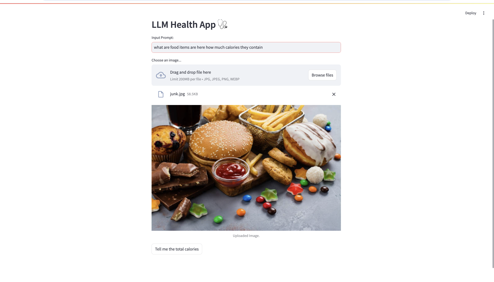
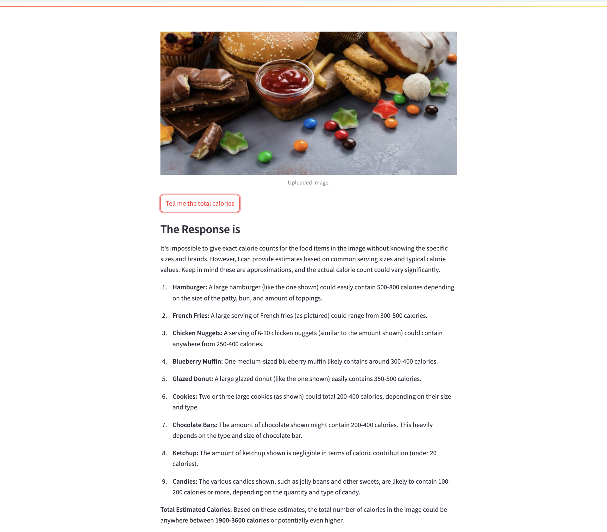

# 🩺 Health Management App 




This is a **Generative AI-powered health app** that analyzes food items from an image and calculates total calorie intake. It uses **Google Gemini Pro Vision API** to detect food items and provide nutritional details.  

## 🚀 Features  
- Upload an image of food items  
- AI-powered food recognition  
- Calculates total calorie intake  
- Provides nutritional details for each food item  

## 🛠️ Technologies Used  
- **Streamlit** (for the web interface)  
- **Google Gemini Pro Vision API** (for AI-based image analysis)  
- **PIL (Pillow)** (for image handling)  
- **Python** (backend processing)  

## 📌 How to Run  
1. Clone this repository:  
   ```sh
   git clone https://github.com/saradune6/Nutritionist-Generative-AI-Doctor-Using-LLM.git
   cd Nutritionist-Generative-AI-Doctor-Using-LLM
